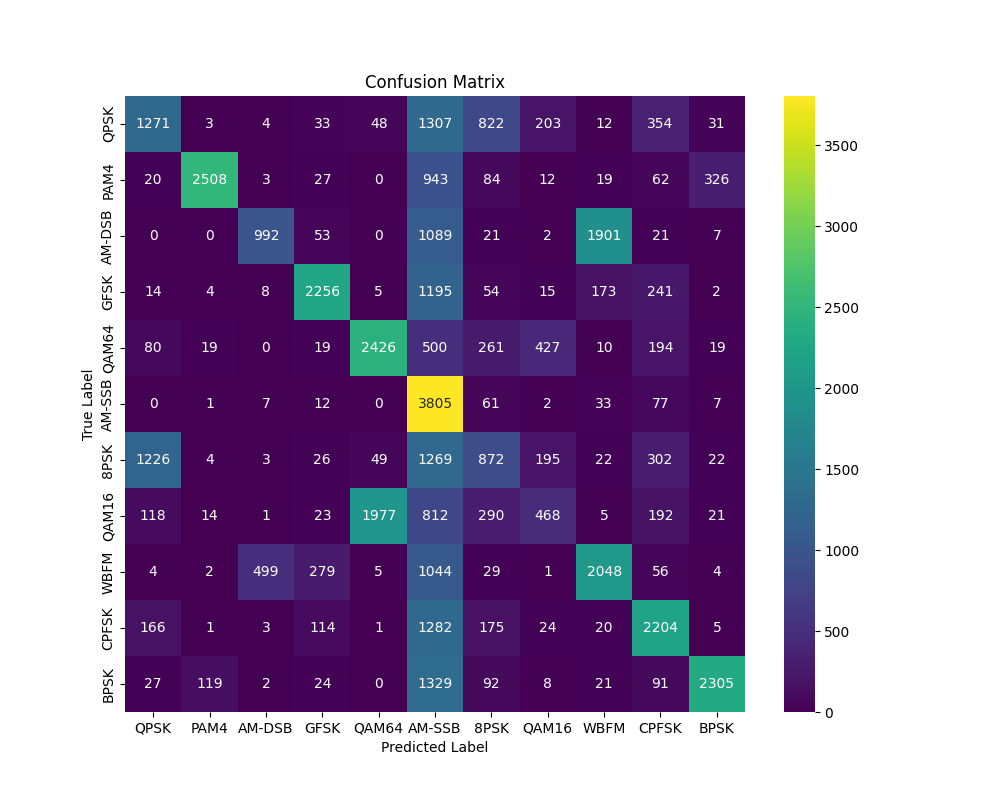

# Modulation Recognition using a Convolutional Neural Network

This is a deep learning project built to automatically identify the modulation scheme of a raw radio signal. It was developed to apply and showcase skills in both Communications Engineering and Artificial Intelligence.

## Key Result: Confusion Matrix
The performance of the trained model on the unseen test set is summarized by the confusion matrix below. The diagonal elements represent correct classifications, showing the model's predictive power for each class.

## About The Project
The project goal was to build an end-to-end deep learning pipeline that:
1.  Processes a complex dataset of I/Q radio signals (RadioML 2016.10a).
2.  Designs and implements a Convolutional Neural Network (CNN) architecture using TensorFlow and Keras.
3.  Trains the model to classify 10 different modulation schemes.
4.  Evaluates the model's performance and provides clear, interpretable visualizations.

### Tech Stack
* Python
* TensorFlow / Keras
* Scikit-learn
* NumPy
* Matplotlib & Seaborn

### How To Run
1.  Clone the repository: `git clone https://github.com/YOUR_USERNAME/YOUR_REPO_NAME.git`
2.  Set up a Python virtual environment and install dependencies. The main libraries are listed in the Tech Stack section.
3.  Download the dataset from [Kaggle](https://www.kaggle.com/datasets/nolasthitnotomorrow/radioml2016-deepsigcom) and place the `RML2016.10a_dict.pkl` file in the root directory.
4.  Run the data preparation script: `python prepare_data.py`
5.  Run the training script: `python train_model.py`
6.  Run the evaluation script: `python evaluate_model.py`

### What I Learned
This project was a fantastic exercise in applying deep learning theory to a real-world engineering problem. Key takeaways include:
- Preprocessing complex signal data for a neural network.
- Implementing a CNN architecture for a task other than traditional image recognition.
- Understanding and interpreting key performance metrics like the classification report and confusion matrix.
- Managing a complete machine learning project workflow from data to evaluation.
